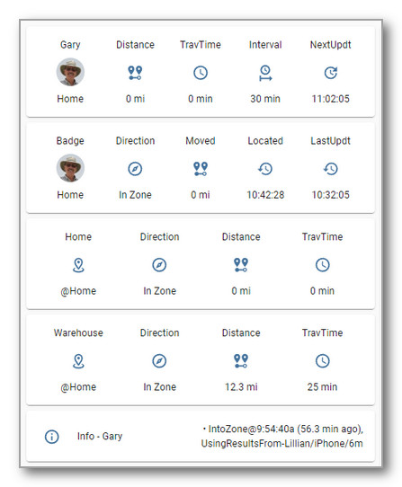
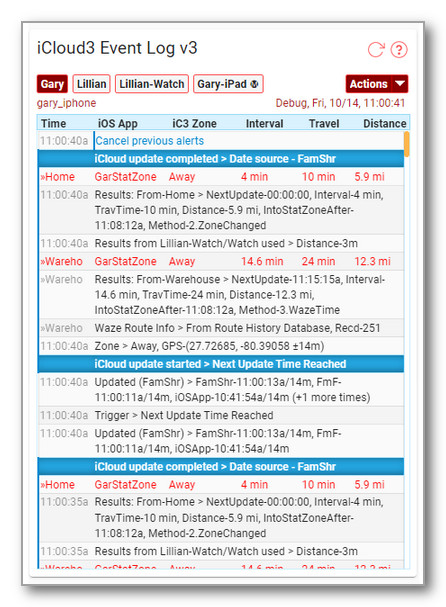
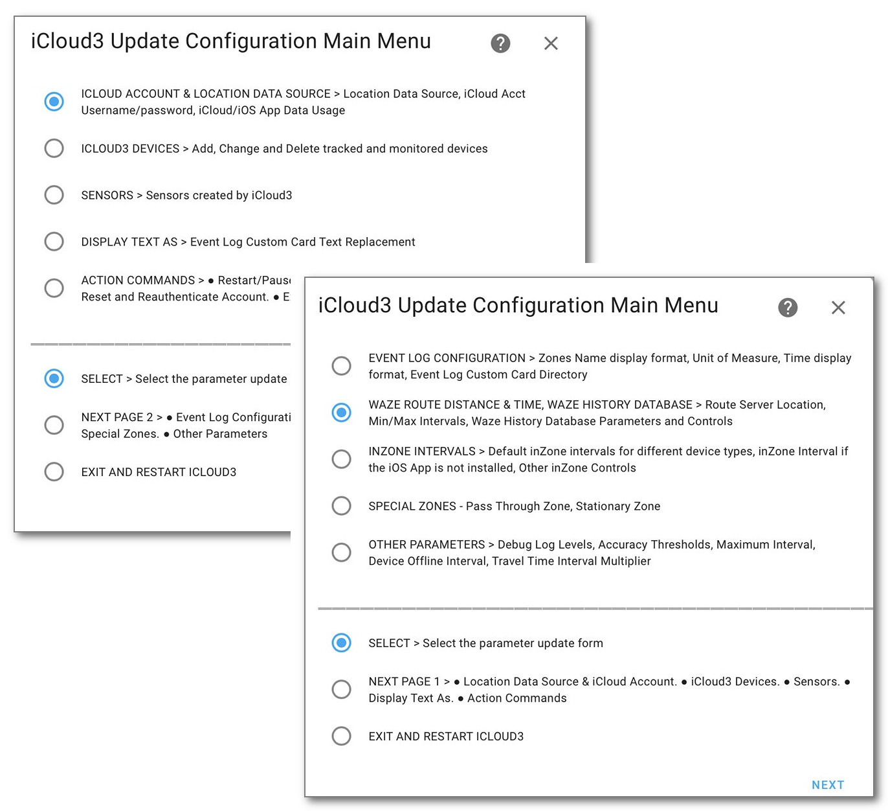
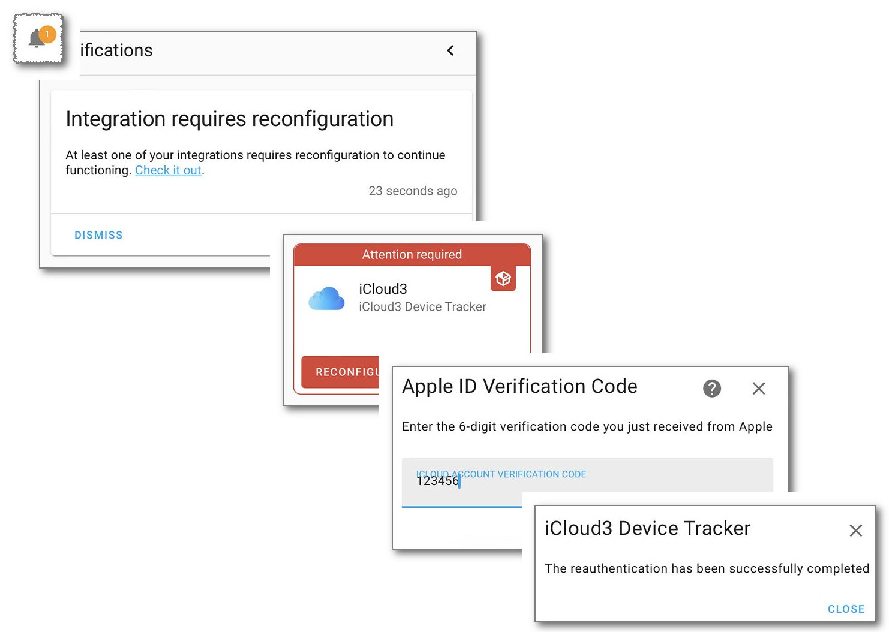
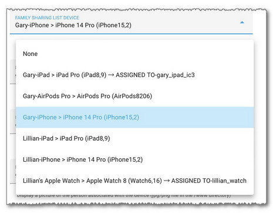
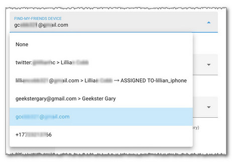
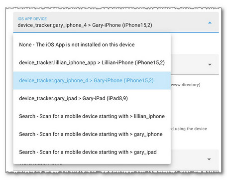

# Getting Started

**Introduction** - iCloud3 is a device tracker that tracks your iPhones, iPads, Apple Watches, AirPods and other Apple devices. It requests location data from Apple's iCloud  Location Services and monitors various triggers sent from the Home Assistant Companion App (iOS App) to Home Assistant. It uses this information to report the device's location, distance from zones, and travel time to zones. It's sensors and other entities can be used to trigger automations based on this location data. 

Home Assistant has it's own official iCloud component. This was used for the initial inspiration for the development of iCloud3, however, iCloud3 goes far beyond the capabilities of the iCloud component. The important highlights include:

- Track devices from those in your Family Sharing list, from those that are sharing their location with you using the FindMy App and those that have the iOS App installed.
- Actively track a device (request a device's location) 
- Passively monitor a device (do not request the location but use it if it is available after another tracked device requests theirs).
- Use the Waze Route Service to determine the travel time and distance to a zone. 
- Provide easy-to-use presence detection that does not rely on any other program, other than Home Assistant and the Home Assistant IOS app.
- Report accurate information, i.e. current zone, location, distance from a zone and travel time on a timely basis that can be used reliably in automations and scripts.
- Track from multiple zones (e.g., Home, Office, Cabin)
- Correct GPS wandering errors leading to incorrect triggering of automations.
- Provide more distance, travel time, and zone attributes than the base iCloud component and to create sensors for many of the attributes that easily display device information on Lovelace cards.
- Monitor the iOS App for zone and location changes.
- Display activity on the iCloud3 Event Log custom Lovelace card.

**Topics in this Chapter** - This chapter provides general information about iCloud3 that will help you how to install, configure and use iCloud3. It covers:

- iCloud3 and the iOS App - How they work together to provide accurate location information
- iCloud3 Components - The iCloud3 custom component, the Event Log, the iCloud3 Configurator.
- Using the iCloud3 Configurator - The menus and screens used to configure iCloud3 and it's devices.
- Tracking methods used by iCloud3 - Family Sharing devices, Find-my-Friends devices, iOS App devices.
- Apple iCloud account - Configuring the username & password.
- Authentication Process - Entering the 6-digit verification code.
- Event Log - Information displayed when iCloud3 starts, the *Actions* dropdown commands.
- The sensors and device_tracker entities created by iCloud3,

The next chapter describes how to install iCloud3, the iOS App and the Event Log. It also explains how to configure iCloud3 for the first time and helps you get up nd running.

------

### The iCloud Account and the iOS App

#### iCloud Account

iCloud3 uses the iCloud Location Service to locate your devices (iPhone, iPad, etc). It provides location information for the devices you are tracking using two methods:

- The family members in the Family Sharing List on your iCloud account (*Family Sharing* or *FamShr*).
- The people (friends) you have added to the FindMy app (*Find-my-Friends* or *FmF*).

 iCloud3 selects the most efficient method to use for each device you are tracking based in how you set up the device parameters and how the location information is returned from iCloud Location Services. 

*Note:* The following documentation will refer to the iPhone (phone) as the device being tracked although it could also refer to a iPad, Apple Watch or other trackable devices.

#### Home Assistant Companion iOS App (iOS App)

The iOS App can be installed on iPhones, iPads and Apple Watches and monitors the device's location and the zone it is currently in (or not in). It will:

- Change the phone's device_tracker entity state and issue a Zone Enter/Exit trigger when it enters or exits a zone.
- Issue location triggers on a regular basis and when there has been a significant location change.  iCloud3 monitors the iOS App device_tracker state for zone and location changes every 5-seconds. 

The HA Proximity component also determines distance between zones and the iPhone, determines direction of travel, and other device_tracker related functions. Unfortunately, the iOS App can report old location information that is processed by the HA proximity component leading to GPS wandering and incorrect zone exits.

!> Do not use the proximity component when using iCloud3. iCloud3 duplicates the proximity functions and discards bad location information where the proximity component does not. 

!>You do not need OwnTracks or other location based trackers and you do not need Nmap, netgear, ping or other network monitors.

------

## iCloud3 Components

iCloud3 has 3-parts -- The iCloud3 custom component,the Event Log Lovelace card and the iCloud3 Configurator.

- i**Cloud3 Custom Component** - The custom component part does all the heavy lifting. 
  - It gets all the devices configuration data from your iCloud account and the digs through Home Assistant for iOS App configuration
  - It requests and processes location from iCloud Location Services and the iOS App.
  - It does all the device tracking.
  - It updates all the sensors associated with each device,
  - There are many pieces in the custom component part; they are installed into the *config/custom_components/icloud3* directory. 
  - 
- **Event Log** - Lots of information about what is going on is shown on the Event log Lovelace custom card. This includes:
  - Startup configuration
  - Trackable device information for family sharing, find-my-friends and iOS App devices and entities,.
  - Tracking results - zone time and distance data.
  - Error messages, problems, location data issues
  - It can also report detail debug events that help identify problems.
  - An *Actions* command menu that is used to restart iCloud3 without restarting Home Assistant, pause and resume tracking, export the Event Log and control debugging and logging.
  - It is installed into the *config/www/icloud3* directory.
  -  
- **iCloud3 Configurato**r - This is used to configure iCloud3 parameters. You can:
  - Set up access to your iCloud account.
  - Configure the devices you want to track.
  - Select sensors you want to create.
  - Customize how items should be displayed in the Event Log.
  - Replace text displayed in the Event Log with another value for security.
  - Configure how results should be reported on the Tracking screens and Event Log.
  - Set up Special Zones - The *Pass Through Zone* and the *Stationary Zone*.
  - Configure Waze Route Service and the Waze History Database.
  - This is found on the *HA Settings > Devices & Services > Integrations* screen. It is setup when you add the iCloud3 Integration.
  - Screen showing the Main Menu that are used to select the various configuration screens.
  -  

------

## Using the iCloud3 Configurator

The Configurator uses 2-menu screens, shown above, to select and update iCloud3 parameters. The menu screens are divided into 2-parts:

- Above above the horizontal line - The update screens for the various parameter categories
- Below the horizontal line - The commands that specify what you want to

------

## iCloud Account Authentication

When iCloud3 logs into your iCloud Account the first time, and every 3-months or so after that, you will be presented with the *Someone is logging into your iCloud Account* notification popup with the map and the *All/Not Allow* options. 

1. Select **Allow** on the *Someone is logging into your iCloud Account* notification popup
2. The 6-digit verification code popup window is displayed. This code is entered on the *Apple ID Verification*  configurator screen next. 
3. After a few seconds, the HA Notification alert is displayed. Tap the **Notification Alert**. The image below shows the sequence of windows you will encounter.
4. A window explaining the notification opens in the upper-left corner. Tap **Check it out**
5. The Integrations page is displayed, the red iCloud3 Configurator is displayed indicating a reauthentication is needed. Tap **Reauthenticate**
6. The Apple ID Verification Code entry window is displayed. **Enter the 6-digit verification code**.
7. Tap **Submit**

 

-----

### iCloud3 Tracking Methods

iCloud3 tracks your phones and other devices using location data from using three sources:

- iCloud Account Family Sharing List location data
- Friends sharing their location with you on the FindMy App
- iOS App location information in it's device_tracker entity

When you configure a device in the Configurator, you will select from a list of available devices for each of these tracking methods.

#### Family Sharing (FamShr)

The Family Sharing tracking method lets you track people on the Family Sharing list on your iCloud account.

- Everyone on the Family Sharing list can be tracked without you doing anything. They are shown in the Family Sharing list on the *iCloud3 Configurator > iCloud3 Devices* screen,
- iCloud locates all the devices on the Family Sharing list at the same time whether-or-not they are tracked by iCloud3. iCloud3 will update the locations of all the tracked devices with the data it receives.
- 

#### Find-My-Friends (FmF)

The Find-my-Friends tracking method lets you track people who are sharing their location with you in the FindMy App.  

- Use this method to track phones that are not on the Family Sharing list on your iCloud account. 
- They have to set up you on their phone's  *FindMy App** and send an authorization to you.
- When you set up their device as a device you want to track on the  *iCloud3 Configurator > iCloud3 Devices* screen, their email address or phone number is selected in the Find-My-Friends devices list.  
- 

To add someone to your Find-my-Friends list, on their phone:

1. On the **FindMy App**, tap **People** or **Devices**.
2. Tap **+** (Plus Sign), then tap **Share My Location**.
3. Select your email address or phone number or enter it in the 'To:' field at the top of the screen, tap **Send**.

#### iOS App (iOSApp)

The iOS App reports location information and zone enter/exit triggers when they occur. iCloud3 uses this information to update the phone's location and to determine if the phone is entering or exiting a zone.  The iOS App needs to be installed on the phone, various iOS App settings have to be turned on and the iOS App device_tracker entity associated with the device has to be selected on the *iCloud3 Configurator > iCloud3 Devices* screen,

iCloud3 does not require the iOS App to be used. It can be used on some devices and not others. The downside of not using it is not receiving zone enter/exit triggers. In this case, iCloud3 will rely on the location reported from the iCloud Location Servers to determine the distance to the zone. When it is less than the zone's size, you are in the zone.

The official documentation for the iOS App (Home Assistant Companion) can be found [here](https://companion.home-assistant.io/).  

-----

### Apple iCloud Account

Two *Configurator* screens are used to set up the Apple iCloud account and to configure a device:

- *iCloud Account Location Data Source* - Set up username and password.
- *iCloud3 Devices* - Add, change and delete the devices that are tracked.

**iCloud Account Location Data Source**

As mentioned, you can use the data provided by your iCloud Location Services (FamShr and FmF tracking methods), the iOS App or both. Normally, you will use both methods, however, you can indicate that the iOS App is not installed on a phone when you configure the phone. 

> The Apple Watch does not provide location information - set the iOS App device to *None*

-----

