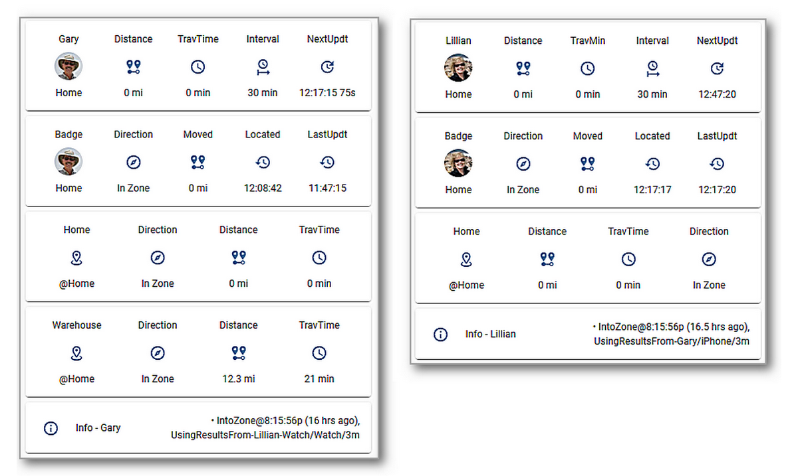
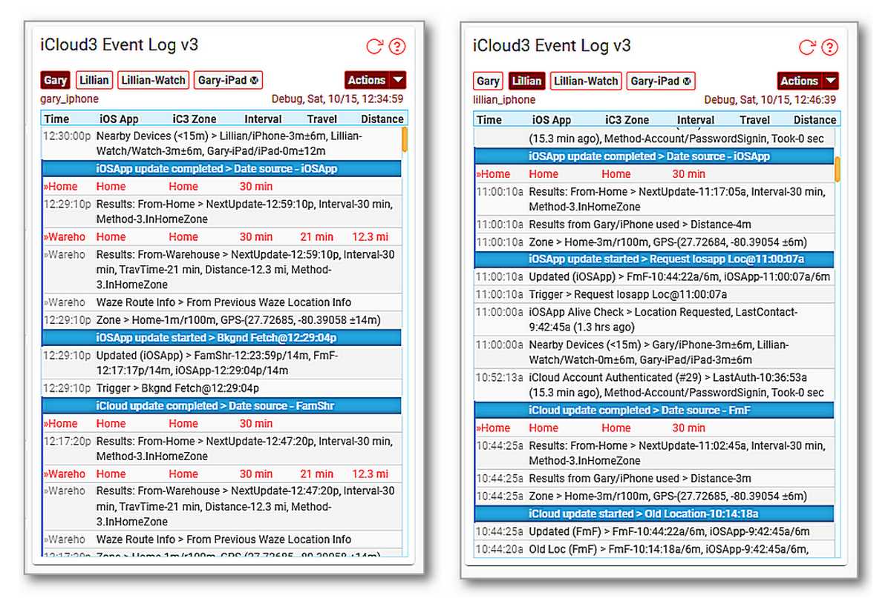

------

There are 3 major parts to the iCloud3 custom component that are used to configure, track and report device location information. Each is described below:

### iCloud3 Custom Component

The iCloud3 Custom Component provides the core device tracking service. It does the following:
  - Initializes and sets up all tracking activities using the device configuration data from t iCloud account.
  - Monitors the iOS App configuration.
  - Requests and processes location data from iCloud Location Services and the iOS App.
  - Analyzes the location data and tracks the devices.
  - Updates the sensors associated with each device.
  - The iCloud3 files are installed in the *config/custom_components/icloud3* directory. 

The screens below show examples of a tracked device's current status. The following is displayed:

- Notice the distance, travel time and travel direction based on the Home Zone. 
- Notice when the device was last located, when it was last updated and the time of the next update. 
- Gary is tracking from Home and the Warehouse Zone, Lillian just from Home.
- The *Info* field shows tracking results from nearby devices is being used.

### Event Log
The Event Log is a Lovelace custom card that shows past and current activity related to tracking a device. This includes:
  - Startup configuration
  - Device information for family sharing, find-my-friends and iOS App devices and entities,.
  - Tracking results - zone time and distance data.
  - Error messages, problems, location data issues.
  - Detail tracking monitors that show what is going on behind the scenes analyzing and processing location data from the iCloud Location Services and the iOS App.
  - An *Actions* command menu that wil:
    - Restart iCloud3 without restarting Home Assistant
    - Pause and resume tracking
    - Relocate all devices
    - Issue a *Find My Device* alert
    - Export the Event Log to a text file
    - Show/hide tracking monitors
    - Start/stop detailed debugging that will dump set up information and all raw data received from iCloud Location Services.

  - The Event Log is installed into the *config/www/icloud3* directory. This directory can be changed on the *Configurator > Event Log Configuration* screen. 
  - It must be added as a resource on the *Settings > Dashboard > Lovelace Resources* screen before it can be used. The steps to do this are described in the *Installing iCloud3 > Step #3 - Set up the Lovelace Resource*.

### iCloud3 Configurator

*The Configurator* is used to configure iCloud3 parameters.  It is opened on the *Settings > Devices & Services > Integrations* screen. Then select *CONFIGURE* on the iCloud3 Integrations entry.

*The Configurator* consists of 2 menus and 10+ parameter entry screens. Each screen has two parts:

- **Selection or parameter entry (top part)** - This is used to select a task to be done, an item to be selected or an option list/ text field for the parameter to be configure.

  - **Command or Action to be done (bottom part)** - First select the desired option (Select/Next/Add/Update/Delete/etc.), then select the command in the bottom right-hand corner of the screen (Next/Submit/Finish/etc.).

Several example screens are shown below, showing these 2-sections. These and the other screens are described in detail in the *Configuring iCloud3 Parameters* chapter.

**Update Configuration Main Menu screens** - These is used to select the specific update screen.

**Update Tracked Device screens** - Adding a new device and updating an existing device is done on this screen.

**Event Log Configuration screen** - Configuring the Event Log field display is done on this screen.

