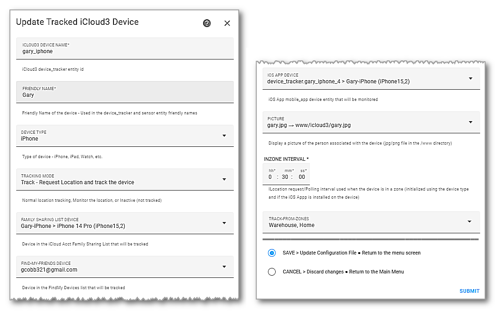

------

The *Settings App > General > About* screen on the iPhone and other devices is used to set up the device's name that is used in the Family Sharing List and FindMy App. The iOS App, once installed on the iPhone, will also use this name to create it's device_tracker entity name that is used by HA and the *mobile_app* integration. Generally, it changes all upper-case letters to lower-case and all spaces to underscores ('Gary iPhone' → 'gary_iphone'). The iOS App may add a suffix number to make this name unique if it is already used.

You will assign an iCloud3 device name (gary_iphone) and a friendly name (Gary) when you add the device on the *iCloud3 Devices >  Update Tracked iCloud3 Device* screen. Those values are used to create the device_tracker entity, sensor entity and the sensor's friendly name:

- device_tracker.gary_iphone
- sensor.gary_iphone_travel_time, sensor.gary_iphone_zone_distance, etc.
- Gary TravelTime, Gary ZoneDistance, etc.

Three screens are used to set up the Apple iCloud account and to configure an iCloud3 device:

- *iCloud Account Login Credentials* - Set up username and password.
- *iCloud3 Devices* - List the devices iCloud3 is tracking and monitoring
- *Update Tracked iCloud3 Device* - Add a new device or update an existing device's information.delete the devices that are tracked.

### iCloud Account Login Credentials

This screen is used to set up your Apple iCloud account username and password. You will also specify if location data will come from the iCloud account, the iOS App or both.
​                                                    

Notes:

1. Select **Login** and **Submit** to login into your iCloud account. 

   - Apple will send you a notification that someone is logging into your iCloud account and display the map with the login location. 
   - Tap **Allow**  to continue and display the 6-digit verification code. 
   - Instructions for entering the 6-digit code are discussed in the next section. Although you can display the entry screen here (Select *Enter) Verification Code*), you may have to also reenter it on the other screen also.

2. The password is stored in the iCloud3 configuration file in an encrypted format. It is displayed here in a hidden format.

   - Select **Show/Hide Username/Password** and **Submit** to show or hide it.

   

​	

### iCloud3 Devices Tracker Entities screens

This screen lists the devices that have been added to iCloud3. Select the device, then select *Update Device* to change it's parameters or *Delete Device* to delete it.

​                                                  

Notes about this screen:

- It shows the iCloud3 device_tracker entity name (devicename) with the friendly name and the Family Sharing device, FindMy device and iOS App device providing location information.
- Deleting the device will remove it from this list, delete the device_tracker.[devicename] and all sensors from Home Assistant.
- !> If you delete it from HA Devices or Entities screen, it will not be deleted from iCloud3.
- iCloud3 will restart when you add or delete a device or update a devices parameters.

### Update Tracked iCloud3 Device

This screen is used to Add a new device or change the parameters of an existing device.

Notes about this screen:

- iCloud3 Device Name - The device_tracker entity name used through Home Assistant to access the device information. 
  - Device Tracker Entity - Example: *device_tracker.[devicename]*
  - Sensor Entity - Example: *sensor.[devicename]_travel_time*

!> Do not change the device_tracker entity name on the HA Devices or Entities screen. Change it here instead. HA will be updated with any changes you make here but the iCloud3 configuration will not be updated if you change it on the HA screens.

- Family Sharing device, FindMy device and iOS App - Select the appropriate device to be associated with this device or None.
- Tracking Mode:
  - Tracked - request location information when necessary.
  - Monitored - use location information returned from iCloud Location Servers when another device asked for it.
  - Inactive - Do not track or monitor this device. This lets you not track a device without deleting from iCloud3.
- Track From Zones - Select another, non Home zones to also track from that zone. This is discussed in the *Device Tracker and Sensor Entities* section.

Note: Additional sensors are created when you are tracking from an additional zone. This is discussed in Chapter # - Sensors.

### Tracking from More than One Zone

Normally, you will only be tracking a device from the Home Zone. The sensor entities related to travel time, distance, intervals, next update time, etc. are all for the Home Zone. However, if you are tracking a device from more than one zone, you will select the other zone(s) on the *iCloud3 Devices* screen (*Track from Zone* parameter). Sensors are created for the Home Zone and for the additional zone(s) with the zone name added to the end of the entity name:

- sensor.gary_iphone_travel_home, sensor.gary_iphone_zone_distance_home, etc.
- Gary TravelTime (Home), Gary ZoneDistance (Home), etc.
- sensor.gary_iphone_travel_time_warehouse, sensor.gary_iphone_zone_distance_warehouse. etc.
- Gary TravelTime (Warehouse), Gary ZoneDistance (Warehouse), etc.

The sensors previously created (sensor.gary_iphone_travel_time, sensor.gary_iphone_zone_distance, etc.) are still created, however their meaning changes. They now contain the results of the closest zone you are traveling towards. If you are closer to the Warehouse Zone, it reports the Warehouse Zone values, if closer to Home, the Home values are reported. When the closer zone is the other zone, it's first letter is displayed in a circle in the 'zone_distance' sensor.

