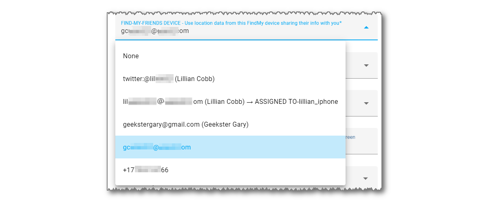

iCloud3 tracks your phones and other devices using location data from using three sources:

- iCloud Account Family Sharing List location data
- Friends sharing their location with you on the FindMy App
- iOS App location information sent from the device to Home Assistant when significant location changes occur, when zone changes occur and on a periodic basis. 

The appropriate device in at least one of these location sources is assigned to the iCloud3 device when it is set up. For example,  *Gary-iPhone > iPhone 14 Pro (iPhone15,2)* is selected as the Family Sharing List device for the *gary_iphone* iCloud3 device. 

The following 3-drop down lists highlight the data source selection method used on the *Update Tracked iCloud3 Device* screen.

------
### Family Sharing (FamShr)

The Family Sharing tracking method lets you track people on the Family Sharing list on your iCloud account.

- The Family Sharing List device is assigned to an iCloud3 device on the *iCloud3 Devices > iCloud3 Device Tracker Entities > Update Tracked iCloud3 Device* screen.
- The selection list shows the device's name in the *Settings App > General > About*  Name field on the device (Gary-iPhone), the device type (iPhone 14 Pro) and Apple model name (iPhone15,2).

------
### Find-My-Friends (FmF)

The Find-my-Friends tracking method lets you track people who are sharing their location with you in the FindMy App.  

- This method will track phones that are not on the Family Sharing list on your iCloud account. 
- The Find-my-Friends device is assigned to an iCloud3 device on the *iCloud3 Devices > iCloud3 Device Tracker Entities > Update Tracked iCloud3 Device* screen.
  

To add someone to your Find-my-Friends list, on their phone:

1. On the **FindMy App**, tap **People** or **Devices**.
2. Tap **+** (Plus Sign), then tap **Share My Location**.
3. Select your email address or phone number or enter it in the 'To:' field at the top of the screen, tap **Send**.

------
### iOS App (iOSApp)

The iOS App reports location information and zone enter/exit triggers when they occur. iCloud3 uses this information to update the phone's location and determine if the phone is entering or exiting a zone.  

- iCloud3 does not require the iOS App to be installed on an iPhone or iPad.

- If the iOS App is not installed on the iPhone or iPad, iCloud3 can not react to a Zone Exit event until the phone's *Next Update Event* time. In this case, a short *inZone Interval* will help reduce the time between location updates.

  Although the iOS App Complication can be installed on the Apple Watch, it does not provide location information. An inZone Interval of 15-minutes should be assigned to the watch to minimize the delay in recognizing the watch has exited a zone.

- Instructions for installing and configuring the iOS App are in the *Installing and Configuring iCloud3 > Step 2 - Installing the iOS App*

- The iOS App device is assigned to an iCloud3 device on the *iCloud3 Devices > iCloud3 Device Tracker Entities > Update Tracked iCloud3 Device* screen. 

!> The official documentation for the iOS App (Home Assistant Companion) can be found [here](https://companion.home-assistant.io/).  

!>  **When a New Device is Purchased** - When a new phone or other device is purchased, both the old and new devices may in this list. The iCloud3 device configuration parameters should be reviewed to ensure the new device is the one selected and being located.