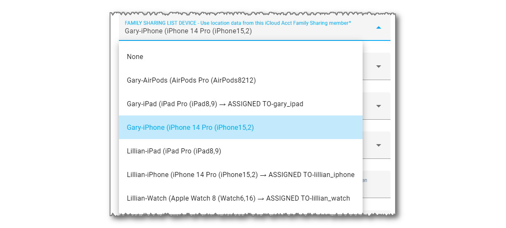

------

iCloud3 tracks your phones and other devices using location data from using three sources:

- iCloud Account Family Sharing List location data
- Friends sharing their location with you on the FindMy App
- iOS App location information sent from the device to Home Assistant when significant location changes occur, when zone changes occur and on a periodic basis. 

The appropriate device in at least one of these location sources is assigned to the iCloud3 device when it is set up. For example,  *Gary-iPhone > iPhone 14 Pro (iPhone15,2)* is selected as the Family Sharing List device for the *gary_iphone* iCloud3 device. 

The following 3-drop down lists highlight the data source selection method used on the *Update Tracked iCloud3 Device* screen.

### Family Sharing (FamShr)

The Family Sharing tracking method lets you track people on the Family Sharing list on your iCloud account.

- This list shows the device's name in the *Settings App > General > About*  Name field on the device (Gary-iPhone), the device type (iPhone 14 Pro) and Apple model name (iPhone15,2) for each device found in the Family Sharing List.

### Find-My-Friends (FmF)

The Find-my-Friends tracking method lets you track people who are sharing their location with you in the FindMy App.  

- Use this method to track phones that are not on the Family Sharing list on your iCloud account. 
- They have to set up you on their phone's  *FindMy App** and send an authorization to you.
- When you set up their device as a device you want to track on the  *iCloud3 Configurator > iCloud3 Devices* screen, their email address or phone number is selected in the Find-My-Friends devices list. 

To add someone to your Find-my-Friends list, on their phone:

1. On the **FindMy App**, tap **People** or **Devices**.
2. Tap **+** (Plus Sign), then tap **Share My Location**.
3. Select your email address or phone number or enter it in the 'To:' field at the top of the screen, tap **Send**.

### iOS App (iOSApp)

The iOS App reports location information and zone enter/exit triggers when they occur. iCloud3 uses this information to update the phone's location and to determine if the phone is entering or exiting a zone.  The iOS App needs to be installed on the phone, various iOS App settings have to be turned on and the iOS App device_tracker entity associated with the device has to be selected on the *iCloud3 Configurator > iCloud3 Devices* screen,

iCloud3 does not require the iOS App to be used. It can be used on some devices and not others. The downside of not using it is not receiving zone enter/exit triggers. In this case, iCloud3 will rely on the location reported from the iCloud Location Servers to determine the distance to the zone. When it is less than the zone's size, you are in the zone. 
 

The official documentation for the iOS App (Home Assistant Companion) can be found [here](https://companion.home-assistant.io/).  

!>  **When a New Device is Purchased** - When a new phone or other device is purchased, both the old and new devices may in this list. The iCloud3 device configuration parameters should be reviewed to ensure the new device is the one selected and being located.