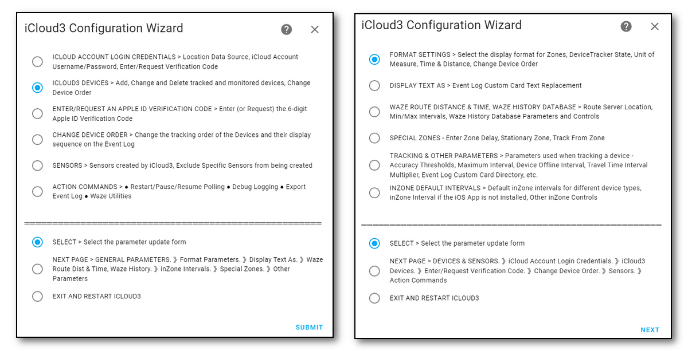

------

There are 3 major parts to the iCloud3 custom component that are used to configure, track and report device location information. Each is described below:

### iCloud3 Custom Component

The custom component part does all the heavy lifting. 
  - It gets all the devices configuration data from your iCloud account and the digs through Home Assistant for iOS App configuration
  - It requests and processes location from iCloud Location Services and the iOS App.
  - It does all the device tracking.
  - It updates all the sensors associated with each device,
  - There are many pieces in the custom component part; they are installed into the *config/custom_components/icloud3* directory. 
    

### Event Log
Lots of information about what is going on is shown on the Event log Lovelace custom card. This includes:
  - Startup configuration
  - Trackable device information for family sharing, find-my-friends and iOS App devices and entities,.
  - Tracking results - zone time and distance data.
  - Error messages, problems, location data issues
  - It can also report detail debug events that help identify problems.
  - An *Actions* command menu that is used to restart iCloud3 without restarting Home Assistant, pause and resume tracking, export the Event Log and control debugging and logging.
  - It is installed into the *config/www/icloud3* directory.
    

### iCloud3 Configurator
This is used to configure iCloud3 parameters. 
  - Screen showing the menu used to select various update screens.
  - 
  - Screen showing the iCloud3 Devices Update that is used to add and configure a device that will be tracked or monitored by iCloud3.
    
