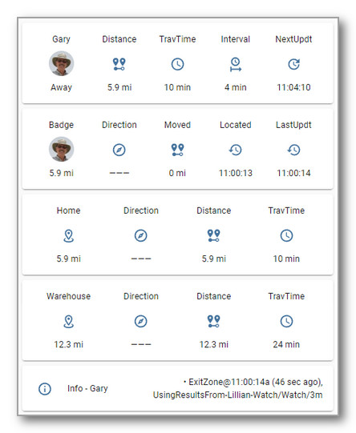

# Getting Started


## The iCloud Components, Installing and Configuring iCloud3

iCloud3 is a device tracker that tracks your iPhones, iPads, Apple Watches, AirPods and other Apple devices. It requests location data from Apple's iCloud  Location Services and monitors various triggers sent from the Home Assistant Companion App (iOS App) to Home Assistant. It uses this information to report the device's location, distance from zones, and travel time to zones. It's sensors and other entities can be used to trigger automations based on this location data. 

Home Assistant has it's own official iCloud component. This was used for the initial inspiration for the development of iCloud3, however, iCloud3 goes far beyond the capabilities of the iCloud component. The important highlights include:

- Track devices from devices in your Family Sharing list, from devices that are sharing their location with you using the FindMy App and those that have the iOS App installed.
- Actively track a device (request a device's location) and monitor a device (do not request the location but use it if it is available after another tracked device requests theirs).
- Use the Waze Route Service to determine the travel time and distance to a zone. 
- Provide easy-to-use presence detection that does not rely on any other program, other than Home Assistant and the Home Assistant IOS app.
- Report accurate information, i.e. current zone, location, distance from a zone and travel time on a timely basis that can be used reliably in automations and scripts.
- Track from more than one zone
- Correct GPS wandering errors leading to incorrect triggering of automations.
- Provide more distance, travel time, and zone attributes than the base iCloud component and to create sensors for many of the attributes that easily display device information on Lovelace cards.
- Monitor the iOS App for zone and location changes.
- Display activity on the iCloud3 Event Log custom Lovelace card.


------

## iCloud3 Components

iCloud3 has 3-parts -- The iCloud3 custom component,the Event Log Lovelace card and the iCloud3 Configurator.

- i**Cloud3 Custom Component** - The custom component part does all the heavy lifting. 
  - It gets all the devices configuration data from your iCloud account and the digs through Home Assistant for iOS App configuration
  - It requests and processes location from iCloud Location Services and the iOS App.
  - It does all the device tracking.
  - It updates all the sensors associated with each device,
  - There are many pieces in the custom component part; they are installed into the *config/custom_components/icloud3* directory. 
  -  
- **Event Log** - Lots of information about what is going on is shown on the Event log Lovelace custom card. This includes:
  - Startup configuration
  - Trackable device information for family sharing, find-my-friends and iOS App devices and entities,.
  - Tracking results - zone time and distance data.
  - Error messages, problems, location data issues
  - It can also report detail debug events that help identify problems.
  - An *Actions* command menu that is used to restart iCloud3 without restarting Home Assistant, pause and resume tracking, export the Event Log and control debugging and logging.
  - It is installed into the *config/www/icloud3* directory.
  -  
- **iCloud3 Configurato**r - This is used to configure iCloud3 parameters. You can:
  - Set up access to your iCloud account.
  - Configure the devices you want to track.
  - Select sensors you want to create.
  - Customize how items should be displayed in the Event Log.
  - Replace text displayed in the Event Log with another value for security.
  - Configure how results should be reported on the Tracking screens and Event Log.
  - Set up Special Zones - The *Pass Through Zone* and the *Stationary Zone*.
  - Configure Waze Route Service and the Waze History Database.
  - This is found on the *HA Settings > Devices & Services > Integrations* screen. It is setup when you add the iCloud3 Integration.
  - Screen showing the Main Menu that are used to select the various configuration screens.
  -  


------

## First Time Installation

There are several steps you need to do to begin using iCloud3 to track your devices. They are:

1. Install iCloud3 from HACS or manually.
2. Set up the Event Log Lovelace card component.
3. Set up the iCloud3 integrations component.
4. Open the iCloud3 Configurator on the integrations screen and add your Apple iCloud account credentitials. You will probably have to authenticate access to your Apple iCloud account.
5. Add at least one device you want to track. When setting it up the first time, it is easier to only set up your device (iPhone) until you are familiar with how iCloud3 operates, that the device_tracker entity for your iPhone is created, the sensors for your iPhone are created and you have a Lovelace screen that displays your device's information and the Event Log.
6. Set up the Lovelace card that displays your devices sensors and the Event Log.


### Installing iCloud3

- **Easy Way** -  Use HACS
  1. Open HACS.
  2. Select **Integrations**
  3. Type **iCloud3** in the Search Bar at the top of the screen. 
  4. Select **iCloud3 Device Tracker**
  5. Select **Download**, then select **Download** again in the popup window.
  6. Restart Home Assistant.
  7. After Home Assistant restarts, set up the iCloud3 Integration described below.
  
- **Hard Way** - Manual Installation
  1. Download the *icloud3.zip* file from the *https://github.com/gcobb321/icloud3* iCloud3 GitHub Repository.
  2. Unzip the file into the *config/sustom_components/icloud3* directory.
  3. Restart Home Assistant.
  4. After Home Assistant restarts, set up the iCloud3 Integration described below.
  
  

### Set up the Event Log Lovelace Card

The Event Log is a custom Lovelace card. When iCloud3 starts the first time, it copies the Event Log custom card file (**icloud3-event-log-card.js*) to the *config/www/icloud3* directory. Every time iCloud3 starts, it checks to see if the latest version is installed and, if not, copies the new version and displays a notice that the browser's cache needs to be cleared (see below) before it can be used. 

> The default directory for the Event Log Card is the *config/www/icloud3* directory. You can change it to another location (e.g.: *www/community/icloud3*) on the *iCloud3 Configurator > Menu Page 2 > Other Parameters* screen. 

**Updating the Lovelace Resource** - The Event Log Cards needs to be added to the Lovelace Resources list before it can be used on a Lovelace screen.

1. Select **Settings > Databoards > ⋮ > Resources**

2. Select **+ Add Resource**

3. The Add Resources window opens, type the following:

4. ```
   URL: 
   /local/icloud3/icloud3-event-log-card.js
   
   RESOURCE TYPE: 
   JavaScript Module
   ```

5. Select **Create**

> *Note: Using another custom card directory* - If you move the Event Log card to another directory, be sure to update the Lovelace Resource parameter. Change the directory (*icloud3*) in the URL statement in step 4 to the new directory name.

**Clearing the Browser's Cache** - The browser (Chrome, Edge, Safari) stores the Home Assistant screens in it's cache. This needs to be cleared to load a new version of the Event Log card. Do this as follows;

1. Press **Ctrl-Shift-Delete**.
2. Select **Cached Images and Files**, the select **Clear Data**
3. Return to the Lovelace screen and click the **Refresh Icon**. 

**Clearing the Home Assistant Companion (iOS App) Cache** - The cache also needs to be cleared on each of the devices (iPhones, iPads) running the Home Assistant Companion app. 

1. In the *Home Assistant Companion App*, tap **Settings > Companion App.**
2. Tap **Debugging > Reset front end cache**
3. Tap **Settings > Done**.
4. Redisplay one of the Lovelace screens and pull it down to reload the screens.


### Set up the iCloud3 Integration

iCloud3 is a Home Assistant Integration and is configured on the Integrations screens.

1. Select **HA Settings > Devices & Services > Integrations**.
2. Select **+ Add Integration** in the lower-right hand corner.
3. Type **iCloud3**. Then select **iCloud3** from the list of Integrations.
4. Follow the instructions on the screen.


------

## Configure iCloud3

iCloud3 needs to be configured with the devices you want to track and and monitor. This is done on the *iCloud3 > Configure* screens found on the *HA Settings > Devices & Services > Integrations* you set up previously. Although nine screens are used to configure all of the iCloud3 parameters, only two need to be set up for iCloud3 to start tracking devices. They are:

- **iCloud Account & Location Data Source**

  - Specify the source of your location data - iCloud Location Servers, the iOS App or both. 

  - Enter your iCloud Account username and password.

- **iCloud Devices**
  - Add the devices you want to track or monitor. This includes assigning a device_tracker entity id to the device, specifying the *friendly name*, selecting the source of the specific location data (Family Sharing List, FindMy App, iOS App) and setting up other parameters for the device. 
- **The Other Configuration Screens**
  - Review the other screens just to see what is configurable. Nothing has to be done right now to get you up and running. The default values will work fine. 

iCloud3 will restart once you are done adding the devices. They will be tracked and you are on your way/

> ! *Chapter 3, Using iCloud3 Configurator* explains each of the configuration screens, the various options you can select and how they can be used.


### iCloud Account Authentication

When iCloud3 logs into your iCloud Account the first time, and every 3-months or so after that, you will be presented with the *Someone is logging into your iCloud Account* notification popup with the map and the *All/Not Allow* options. 

1. Select **Allow** on the *Someone is logging into your iCloud Account* notification popup
2. The 6-digit verification code popup window is displayed. This code is entered on the *Apple ID Verification*  configurator screen next. 
3. After a few seconds, the HA Notification alert is displayed. Tap the **Notification Alert**. The image below shows the sequence of windows you will encounter.
4. A window explaining the notification opens in the upper-left corner. Tap **Check it out**
5. The Integrations page is displayed, the red iCloud3 Configurator is displayed indicating a reauthentication is needed. Tap **Reauthenticate**
6. The Apple ID Verification Code entry window is displayed. **Enter the 6-digit verification code**.
7. Tap **Submit**


 

### Set up an iCloud3 screen

The layout of the raw yaml code for the *iCloud Custom Component* and *Event Log* screen is shown in the *Sample Screens, Automations and Scripts* chapter.

1. Copy the raw yaml code for the screen you want to use to get you going.
2. Create and/or edit the Lovelace screen as you do with any screen layout.
3. Create a new card for the iCloud3 entities.
4. Go into the yaml editor, copy the yaml code from the sample screens.
5. Change the entity names to the names you have assigned to your devices.


### The iCloud Account and the iOS App

###### iCloud Account  

iCloud3 uses the iCloud Location Service to locate your devices (iPhone, iPad, etc). It provides location information for the devices you are tracking using two methods:

- The family members in the Family Sharing List on your iCloud account (*Family Sharing* or *FamShr*).
- The people (friends) you have added to the FindMy app (*Find-my-Friends* or *FmF*).

 iCloud3 selects the most efficient method to use for each device you are tracking based in how you set up the device parameters and how the location information is returned from iCloud Location Services. 

*Note:* The following documentation will refer to the iPhone (phone) as the device being tracked although it could also refer to a iPad, Apple Watch or other trackable devices.

###### Home Assistant Companion iOS App (iOS App)   

The iOS App can be installed on iPhones, iPads and Apple Watches and monitors the device's location and the zone it is currently in (or not in). It will:

- Change the phone's device_tracker entity state and issue a Zone Enter/Exit trigger when it enters or exits a zone.
- Issue location triggers on a regular basis and when there has been a significant location change.  iCloud3 monitors the iOS App device_tracker state for zone and location changes every 5-seconds. 

The HA Proximity component also determines distance between zones and the iPhone, determines direction of travel, and other device_tracker related functions. Unfortunately, the iOS App can report old location information that is processed by the HA proximity component leading to GPS wandering and incorrect zone exits.

!> Do not use the proximity component when using iCloud3. iCloud3 duplicates the proximity functions and discards bad location information where the proximity component does not. 

!>You do not need OwnTracks or other location based trackers and you do not need Nmap, netgear, ping or other network monitors.

-----

### iCloud3 Tracking Methods

As described above, iCloud3 tracks your phones using two methods - *icloud* and *iosapp*. As mentioned earlier, there are two ways the location is provided by iCloud Location Services. They are: 

#### Family Sharing (FamShr)

The Family Sharing tracking method lets you track people on the Family Sharing list on your iCloud account.

- Everyone on the Family Sharing list can be tracked without you doing anything. They are shown in the Family Sharing list on the *iCloud3 Configurator > iCloud3 Devices* screen,
- iCloud locates all the devices on the Family Sharing list at the same time whether-or-not they are tracked by iCloud3. iCloud3 will update the locations of all the tracked devices with the data it receives.

#### Find-My-Friends (FmF)

The Find-my-Friends tracking method lets you track people who are sharing their location with you in the FindMy App.  

- Use this method to track phones that are not on the Family Sharing list on your iCloud account. 
- They have to set up you on their phone's  *FindMy App** and send an authorization to you.
- When you set up their device as a device you want to track on the  *iCloud3 Configurator > iCloud3 Devices* screen, their email address or phone number is selected in the Find-My-Friends devices list.  

To add someone to your Find-my-Friends list, on their phone:

1. On the **FindMy App**, tap **People** or **Devices**.
2. Tap **+** (Plus Sign), then tap **Share My Location**.
3. Select your email address or phone number or enter it in the 'To:' field at the top of the screen, tap **Send**.

#### iOS App (iOSApp)

The iOS App reports location information and zone enter/exit triggers when they occur. iCloud3 uses this information to update the phone's location and to determine if the phone is entering or exiting a zone.  The iOS App needs to be installed on the phone, various iOS App settings have to be turned on and the iOS App device_tracker entity associated with the device has to be selected on the *iCloud3 Configurator > iCloud3 Devices* screen,

iCloud3 does not require the iOS App to be used. It can be used on some devices and not others. The downside of not using it is not receiving zone enter/exit triggers. In this case, iCloud3 will rely on the location reported from the iCloud Location Servers to determine the distance to the zone. When it is less than the zone's size, you are in the zone.

The official documentation for the iOS App (Home Assistant Companion) can be found [here](https://companion.home-assistant.io/).  

-----


-----

