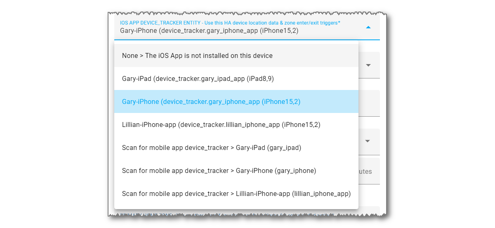

iCloud3 tracks your phones and other devices using location data from using three sources:

- iCloud Account Family Sharing List location data
- Friends sharing their location with you on the FindMy App
- iOS App location information in it's device_tracker entity

When you configure a device in the Configurator, you will select from a list of available devices for each of these tracking methods.

### Family Sharing (FamShr)

The Family Sharing tracking method lets you track people on the Family Sharing list on your iCloud account.

- Everyone on the Family Sharing list can be tracked without you doing anything. They are shown in the Family Sharing list on the *iCloud3 Configurator > iCloud3 Devices* screen,
- iCloud locates all the devices on the Family Sharing list at the same time whether-or-not they are tracked by iCloud3. iCloud3 will update the locations of all the tracked devices with the data it receives.  

### Find-My-Friends (FmF)

The Find-my-Friends tracking method lets you track people who are sharing their location with you in the FindMy App.  

- Use this method to track phones that are not on the Family Sharing list on your iCloud account. 
- They have to set up you on their phone's  *FindMy App** and send an authorization to you.
- When you set up their device as a device you want to track on the  *iCloud3 Configurator > iCloud3 Devices* screen, their email address or phone number is selected in the Find-My-Friends devices list.        

To add someone to your Find-my-Friends list, on their phone:

1. On the **FindMy App**, tap **People** or **Devices**.
2. Tap **+** (Plus Sign), then tap **Share My Location**.
3. Select your email address or phone number or enter it in the 'To:' field at the top of the screen, tap **Send**.

### iOS App (iOSApp)

The iOS App reports location information and zone enter/exit triggers when they occur. iCloud3 uses this information to update the phone's location and to determine if the phone is entering or exiting a zone.  The iOS App needs to be installed on the phone, various iOS App settings have to be turned on and the iOS App device_tracker entity associated with the device has to be selected on the *iCloud3 Configurator > iCloud3 Devices* screen,

iCloud3 does not require the iOS App to be used. It can be used on some devices and not others. The downside of not using it is not receiving zone enter/exit triggers. In this case, iCloud3 will rely on the location reported from the iCloud Location Servers to determine the distance to the zone. When it is less than the zone's size, you are in the zone. 

​          		

​     

The official documentation for the iOS App (Home Assistant Companion) can be found [here](https://companion.home-assistant.io/).  
