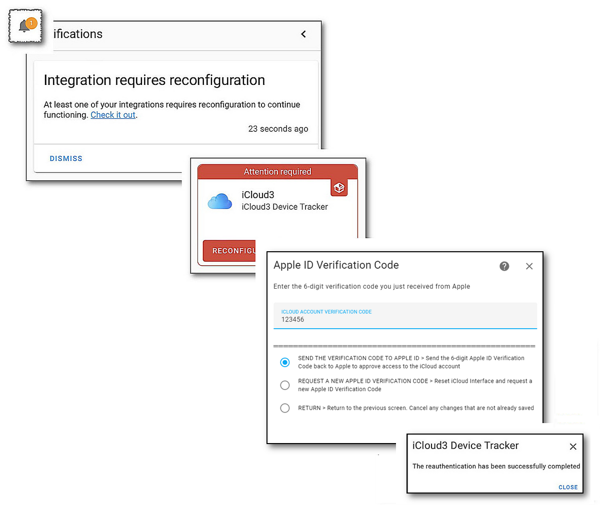

## iCloud Account Authentication

When iCloud3 logs into your iCloud Account the first time, and every 3-months or so after that, you will be presented with the *Someone is logging into your iCloud Account* notification popup with the map and the *All/Not Allow* options. 

1. Select **Allow** on the *Someone is logging into your iCloud Account* notification popup
2. The 6-digit verification code popup window is displayed. This code is entered on the *Apple ID Verification*  configurator screen next. 
3. After a few seconds, the HA Notification alert is displayed. Tap the **Notification Alert**. The image below shows the sequence of windows you will encounter.
4. A window explaining the notification opens in the upper-left corner. Tap **Check it out**
5. The Integrations page is displayed, the red iCloud3 Configurator is displayed indicating a reauthentication is needed. Tap **Reauthenticate**
6. The Apple ID Verification Code entry window is displayed. **Enter the 6-digit verification code**.
7. Tap **Submit**

 