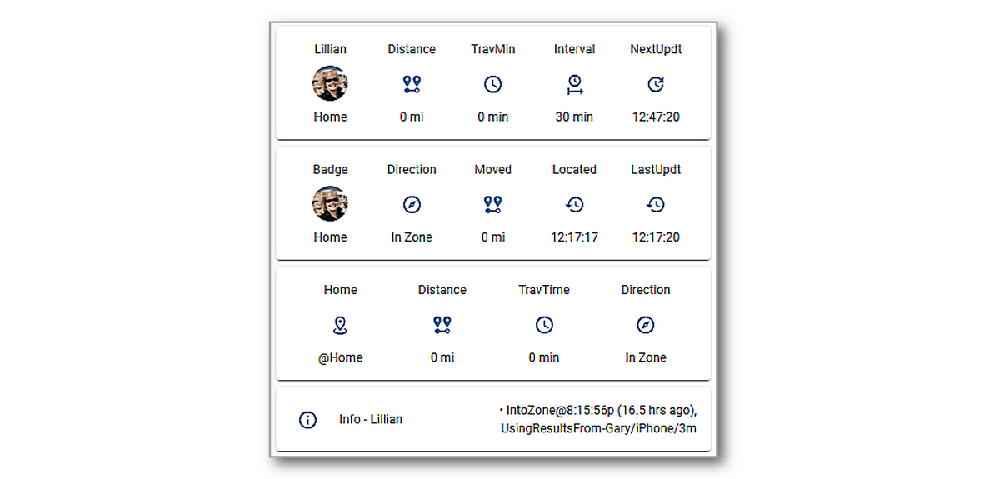

# Installing and Configuring iCloud3

------

## Installation Steps

There are several steps you need to do to begin using iCloud3 to track your devices. They are:

1. Install iCloud3 from HACS or manually.
2. Install and configure the HA Companion App (iOS App).
3. Set up the Event Log Lovelace card component.
4. Set up the iCloud3 integrations component (iCloud3 Configurator). Then open it to set up your Apple iCloud account and devices you want to track. 
5. Add your Apple iCloud account credentitials and authenticate access to your account.
6. Add at least one device you want to track. When setting it up the first time:
   - Set up only your device (iPhone) until you are familiar with how iCloud3 operates.
   - Verify the device_tracker entity and the sensors for your iPhone are created.
7. Set up the Lovelace card that displays your devices sensors and the Event Log.

These steps are described below.


------

## Step #1 - Install iCloud3

- **Easy Way** -  Use HACS
  1. Open HACS.
  
  2. Select **Integrations**
  
  3. Type **iCloud3** in the Search Bar at the top of the screen. 
  
  4. Select **iCloud3 Device Tracker**
  
  5. Select **Download**, then select **Download** again in the popup window.
  
  6. **Restart Home Assistant**
  
     
  
- **Hard Way** - Manual Installation
  1. Download the *icloud3.zip* file from the *https://github.com/gcobb321/icloud3* iCloud3 GitHub Repository.
  2. Unzip the file into the *config/sustom_components/icloud3* directory.
  3. **Restart Home Assistant**


## Step #2 - Install the iOS App on your iPhone or iPad


## Step #3 - Set up the Lovelace Resource for the iCloud3 Event Log card

The Event Log is a custom Lovelace card. When iCloud3 starts the first time, it copies the Event Log custom card file (**icloud3-event-log-card.js*) to the *config/www/icloud3* directory. Every time iCloud3 starts, it checks to see if the latest version is installed and, if not, copies the new version and displays a notice that the browser's cache needs to be cleared (see below) before it can be used. 

> The default directory for the Event Log Card is the *config/www/icloud3* directory. You can change it to another location (e.g.: *www/community/icloud3*) on the *iCloud3 Configurator > Menu Page 2 > Other Parameters* screen. 

**Updating the Lovelace Resource** - The Event Log Cards needs to be added to the Lovelace Resources list before it can be used on a Lovelace screen.

1. Select **Settings > Dashboards > ⋮ > Resources**

2. Select **+ Add Resource**

3. The Add Resources window opens, type the following:

4. ```
   URL: 
   /local/icloud3/icloud3-event-log-card.js
   
   RESOURCE TYPE: 
   JavaScript Module
   ```

5. Select **Create**

> *Note: Using another custom card directory* - If you move the Event Log card to another directory, be sure to update the Lovelace Resource parameter. Change the directory (*icloud3*) in the URL statement in step 4 to the new directory name and select the directory name you are using in the *Event Log Directory* field on the *iCloud3 Configurator > Menu Page 2 > Other Parameters*  screen.

**Clearing the Browser's Cache** - The browser (Chrome, Edge, Safari) stores the Home Assistant screens in it's cache. This needs to be cleared to load a new version of the Event Log card. Do this as follows;

1. Press **Ctrl-Shift-Delete**.
2. Select **Cached Images and Files**, the select **Clear Data**
3. Return to the Lovelace screen and click the **Refresh Icon**. 

**Clearing the Home Assistant Companion (iOS App) Cache** - The cache also needs to be cleared on each of the devices (iPhones, iPads) running the Home Assistant Companion app. 

1. In the *Home Assistant Companion App*, tap **Settings > Companion App.**
2. Tap **Debugging > Reset front end cache**
3. Tap **Settings > Done**
4. Redisplay one of the Lovelace screens and pull it down to reload the screens.


## Step #4 - Set up the iCloud3 Integration

iCloud3 is a Home Assistant Integration and is configured on the Integrations screens.

1. Select **HA Settings > Devices & Services > Integrations**.
2. Select **+ Add Integration** in the lower-right hand corner.
3. Type **iCloud3**. Then select **iCloud3** from the list of Integrations.
4. Follow the instructions on the screen.


## Step #5 - Configure iCloud3

iCloud3 needs to be configured with the devices you want to track and and monitor. To open the *Configurator*:

1. Select **HA Settings > Devices & Services > Integrations**
2. Select **iCloud3 > Configure** 

 Although nine screens are used to configure all of the iCloud3 parameters, only two need to be set up for iCloud3 to start tracking devices. They are:

- **iCloud Account & Location Data Source**

  - Specify the source of your location data - iCloud Location Servers, the iOS App or both. 

  - Enter your iCloud Account username and password.

- **iCloud3 Devices**
  - Add the devices you want to track or monitor. This includes assigning a device_tracker entity id to the device, specifying the *friendly name*, selecting the source of the specific location data (Family Sharing List, FindMy App, iOS App) and setting up other parameters for the device. 
- **The Other Configuration Screens**
  - Review the other screens just to see what is configurable. Nothing has to be done right now to get you up and running. The default values will work fine. 

iCloud3 will restart once you are done adding the devices. They will be tracked and you are on your way/

> ! *Chapter 3, Using iCloud3 Configurator* explains each of the configuration screens, the various options you can select and how they can be used.[](../images/auth-process.jpg)

 

## Step #6 - Set up an iCloud3 screen showing tracking information

Two types Lovelace cards are used to show the tracking results of a device/

- **Tracking card** - The tracking card shows shows the device_tracker and primary sensor entities related to the travel time, distance, location request times, etc.
- **Event Log Card** - Shows the tracking activity of all of the devices.

### Set up a Tracking Lovelace card

The following tracking screen shows the current status for Lillian 's iPhone (*lillian_iphone*). The steps for adding this to the Lovelace dashboard are below. You will obviously need to change the entity names of *lillian_iphone* to your phone in the yaml code.



The yaml code for this is shown below. 

```yaml
type: grid
cards:
  - type: glance
    show_name: true
    show_icon: true
    show_state: true   
    entities:
      - entity: device_tracker.lillian_iphone
        name: Lillian
      - entity: sensor.lillian_iphone_zone_distance
        name: Distance
      - entity: sensor.lillian_iphone_travel_time_min
        name: TravMin
      - entity: sensor.lillian_iphone_interval
        name: Interval
      - entity: sensor.lillian_iphone_next_update
        name: NextUpdt
    state_color: true
    columns: 5
  - type: glance
    show_name: true
    show_icon: true
    show_state: true
    entities:
      - entity: sensor.lillian_iphone_badge
        name: Badge
      - entity: sensor.lillian_iphone_dir_of_travel
        name: Direction
      - entity: sensor.lillian_iphone_travel_distance
        name: Moved
      - entity: sensor.lillian_iphone_last_located
        name: Located
      - entity: sensor.lillian_iphone_last_update
        name: LastUpdt
    columns: 5
  - type: glance
    show_name: true
    show_icon: true
    show_state: true
    entities:
      - entity: sensor.lillian_iphone_zone_info_home
        name: Home
      - entity: sensor.lillian_iphone_distance_home
        name: Distance
      - entity: sensor.lillian_iphone_travel_time_home
        name: TravTime
      - entity: sensor.lillian_iphone_dir_of_travel_home
        name: Direction
  - type: entities
    entities:
      - entity: sensor.lillian_iphone_info
        name: Info - Lillian
        icon: mdi:information-outline
columns: 1
square: false

```

To create this Lovelace screen, do the following:

1. Tap **'+' (plus sign)** at the top to open the View Configuration screen.
2. Enter the following:
   1. Title: **iCloud3**
   2. icon: **mdi:weather-cloudy**
   3. Select **Save**
3. Select **+ Add Card**, the *Which card would you like to add ...* is displayed.
4. Select **Grid**
5. Select **Show Code Editor** at the bottom of the screen.'
6. Copy the yaml code above into the code editor (erase the default lines that are displayed). 
7. The yaml code above is for the iCloud3 device named *lillian_iphone*. Change that value in the yaml code to the iCloud3 device name you created for your phone on the *iCloud3 devices* screen when configuring iCloud in Step #5 above.
8. Select **Save


### Set up the Event Log card

Add the *Event Log Card* to the dashboard you created above. This uses the *Resource* you set up in Step #3 above.


The yaml code for this is shown below. 
```
type: grid
cards:
  - type: custom:icloud3-event-log-card
square: false
columns: 1
```

1. Select **+ Add Card**, the *Which card would you like to add ...* is displayed.
2. Select **Grid**
3. Select **Show Code Editor** at the bottom of the screen.'
4. Copy the yaml code above into the code editor (erase the default lines that are displayed). 
6. Select **Save**


## Step #7 - Restart Home Assistant

Restart Home Assistant to make sure iCloud3 starts, tracking begins and the Tracking and Event Log screens display correctly. 

When iCloud3 starts, it follows a startup process to check directory settings, load the configuration parameters, load the tracked and monitored devices, access the your iCloud account to get the devices tied o your account, get the information for the devices using the HA Companion App, tie everything together and start tracking. The results of this process are shown in the Event Log and detailed in Chapter 1 - Starting iCloud3 and the Event Log.
