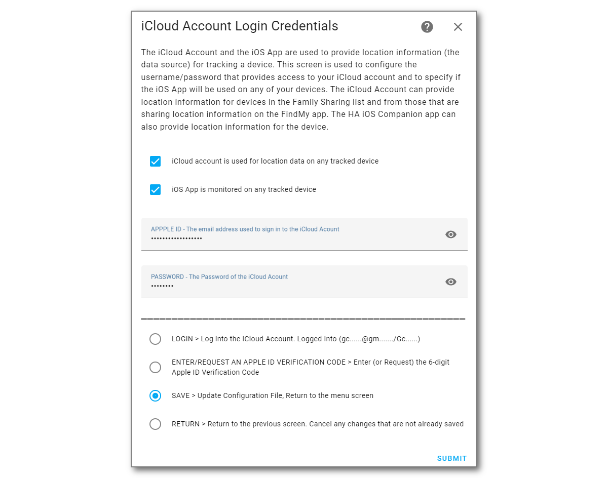
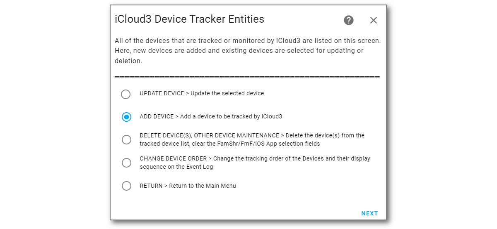
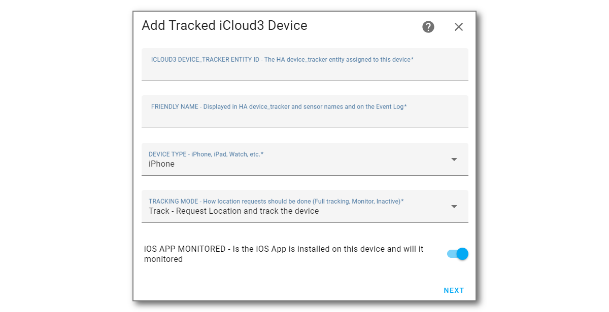
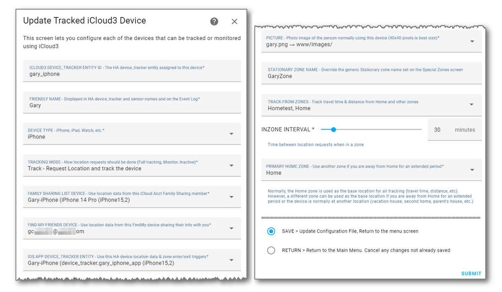
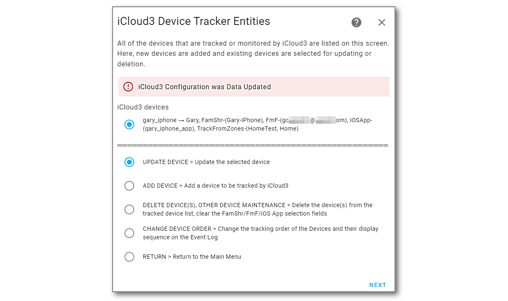
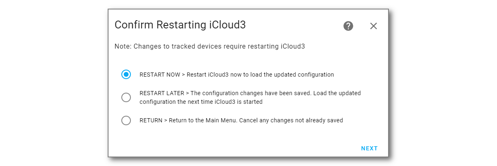
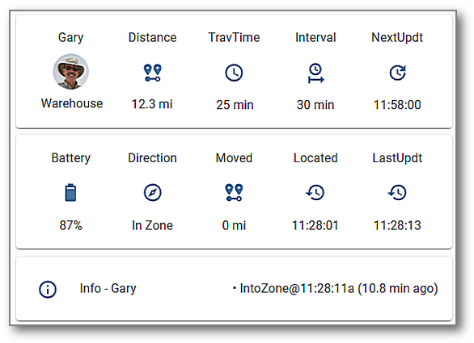

# Installing and Configuring iCloud3

There are several steps you need to do to begin using iCloud3 to track your devices. They are:

1. Install iCloud3 from HACS (or manually).
2. Install and configure the HA Companion App (iOS App).
3. Set up the Event Log Lovelace card component.
4. Add the iCloud3 integrations component (iCloud3 Configurator). 
5. Open *The Configurator*, set up your Apple iCloud account and add your iPhone to the tracked device list. 
6. Add your Apple iCloud account credentitials and authenticate access to your account.
7. Set up a Lovelace card for for your iPhone.
8.  Set up a Lovelace card for the Event Log.
9. Restart Home Assistant.

These steps are described below.


------

### Step #1 - Install iCloud3

- **Easy Way** -  Use HACS
  1. Open HACS.
  
  2. Select **Integrations**.
  
  3. Type **iCloud3** in the Search Bar at the top of the screen. 
  
  4. Select **iCloud3 Device Tracker**.
  
  5. Select **Download**, then select **Download** again in the popup window.
  
  6. **Restart Home Assistant**.
  
     
  
- **Hard Way** - Manual Installation
  1. Download the *icloud3.zip* file from the *https://github.com/gcobb321/icloud3* iCloud3 GitHub Repository.
  2. Unzip the file into the *config/sustom_components/icloud3* directory.
  3. **Restart Home Assistant**


------

### Step #2 - Install the iOS App on your iPhone or iPad

The iOS App is not required for iCloud3 to track devices. But it helps and it's benefits have already been discussed. It can be installed on some iPhones and not others. You can, for example, install it on your iPhone and not your wife's. 

The official documentation for the iOS App (Home Assistant Companion) can be found [here](https://companion.home-assistant.io/).  Select *Getting Started* for instructions on installing and configuring the iOS App.


------

### Step #3 - Set up the Lovelace Resource for the iCloud3 Event Log card

The Event Log is a custom Lovelace card. When iCloud3 starts the first time, it copies the Event Log custom card file (*icloud3-event-log-card.js*) to the *config/www/icloud3* directory. 

> When iCloud3 starts, it verifies that the latest version is installed in the *config/www/icloud3* directory. If not, the new version (in the *config/custom_components/icloud3* directory) is copied to the *config/www/icloud3* directory. An alert notice is also displayed indicating the browser's cache needs to be cleared (see below) before it can be used in the Event Log and on the devices.

Note: The default directory for the Event Log Card is the *config/www/icloud3* directory. It can be changed it to another location (e.g.: *www/community/icloud3*) on the *iCloud3 Configurator > Menu Page 2 > Event Log Configuration* screen. 

#### Updating the Lovelace Resource

The Event Log Card must to be added to the Lovelace Resources list before it can be used on a Lovelace screen.

1. Select **☰ > HA Settings > Dashboards > ⋮ (Upper right corner) > Resources**

2. Select **+ Add Resource** to open the Add Resources window.


3. in the **URL** field, type **/local/icloud3/icloud3-event-log-card.js**
4. **Select **Create (or Update)**

> *Note: Using another custom card directory* - If you move the Event Log card to another directory, be sure to update the Lovelace Resource parameter. Change the directory (*icloud3*) in the URL statement in step 4 to the new directory name and select the directory name you are using in the *Event Log Directory* field on the *iCloud3 Configurator > Menu Page 2 > Other Parameters*  screen.


#### Clearing the Browser's Cache

The browser (Chrome, Edge, Safari) stores the Home Assistant screens in it's cache. This needs to be cleared to load the new version of the Event Log card.

1. Press **Ctrl-Shift-Delete**.
2. Select **Cached Images and Files**, the select **Clear Data**
3. Return to the Lovelace screen and click the **Refresh Icon**. 


#### Clearing the Home Assistant Companion (iOS App) Cache

<u>The cache also needs to be cleared on every of the devices</u> (iPhones, iPads) running the Home Assistant Companion app. 

1. In the *Home Assistant Companion App*, tap **☰ > HA Settings > Companion App.**
2. Tap **Debugging > Reset front end cache**
3. Tap **Settings > Done**
4. Redisplay one of the Lovelace screens and pull it down to reload the screens.


------

### Step #4 - Set up the iCloud3 Integration

iCloud3 is a Home Assistant Integration and is configured on the Integrations screens.

1. Select **☰ > HA Settings > Devices & Services > Integrations**.
2. Select **+ Add Integration** in the lower-right hand corner.
3. Type **iCloud3**. Then select **iCloud3** from the list of Integrations. The iCloud3 entry will be added to the *Integrations* screen.


4. Select **Configure** 


------

### Step #5 - Configure iCloud3

iCloud3 needs to be configured with the devices you want to track and and monitor. To open *The Configurator*:

1. Select **☰ > HA  Settings > Devices & Services > Integrations**
2. Select **iCloud3 > Configure** as shown above.

Although nine screens are used to configure all of the iCloud3 parameters, only two need to be set up for iCloud3 to start tracking devices. 

1. Add the settings for your Apple iCloud account on the *iCloud Account & Login Credentials screen*.
2. Add a tracked device on the 

#### iCloud Account & Login Credentials screen

1. Enter your **iCloud Account username** and **password**.
2. Select **Login**, then select **Submit**.  The iCloud account will be logged into and the iPhones, iPads and other devices associated with the account will be loaded.



Notes:

- Normally, both the iCloud account and the iOS App provides location data. If, however, you are not using the iOS App on any device, and have no plans to do so, set the *Location Data Source* to *iCloud data only*.
- The *password* is stored in the configuration file in an encrypted format. 
- The *username* and *password* fields are obscured on this screen. Select *Show/Hide username/password* to and select *Submit* to display them.


#### iCloud3 Devices screen

Up to 10-devices can be tracked by iCloud3. They are shown on this screen lists. 

1. Select **Add Device**, then select **Next** to display the *Add Device* screen




#### Add Tracked iCloud3 Device screen

New iCloud3 tracked devices are add on this screen.

1. Assign a  **iCloud3 Device Name** to the device (*gary_iphone*). This will create the *device-tracker.[devicename]* entity and the *sensor.[devicename]_[sensorname]* entities for this device.



2. Type the **Friendly Name** (*Gary*) and change the **Device Type** if necessary.


3. Select **Next** to display the *Update Tracked iCloud3 Device* screen.

Notes:

- The *Tracking Mode* field describes how the device will be tracked: 
  - Track - Request the location and track the device,
  - Monitor - Do not request the location. Report it's location when it is requrned from an iCloud location request for another device.
  - Inactive - Not tracked or monitored. This option keeps the device's parameters in the the configuration file but does not track it. 


#### Update Tracked iCloud3 Device screen

This screen is used to specify various parameters used by iCloud3 to track the device. The major parameters are::

- Specify the names of the actual device from the Family Share List, the Find-my-Friends list and the iOS App device tracker entities providing location information.
- Select a picture to be displayed on the *device_tracker.[devicename]* entity and the *[sensor.[devicename]_badge* entity.



1. Select and enter the parameters for this device.
2. Select **Submit** to add the device. It will be added to the *iCloud3 Device Tracker Entities* screenn.




#### Exit *The Configurator* and Restart iCloud3

Since a tracked device was updated, iCloud3 will restart when you exit *The Configurator*.

1. Select **Return**, then select **Next** to display the **Main Menu** screen.
2. Select **Exit and Restart**, then select **Next** to exit *The Configurator* and display the *Confirm Restarting iCloud3* screen.



1. Select **Restart Now**, then select **Next**.
2. Select **Finish** on the final *Success, Options Successfully Saved* screen.
3. iCloud3 will restart, the device_tracker and sensor entities are created, the device will be located and tracking will begin.


#### The Other Configuration Screens

Review the other screens just to see what is configurable. Nothing has to be done right now to get you up and running. The default values will work fine. The other screens are shown and described in *Configuring iCloud3 using The Configurator* in the next chapter


------

### Step #6 - Set up a Lovelace card tracking card

The following tracking screen shows the current status for Gary 's iPhone (*gary_iphone*). The steps for adding this to the Lovelace dashboard are below. You will obviously need to change the entity names of *gary_iphone* to your phone in the yaml code.



The yaml code for this is shown below. 

```yaml
type: grid
cards:
  - type: glance
    show_name: true
    show_icon: true
    show_state: true   
    entities:
      - entity: device_tracker.gary_iphone
        name: Gary
      - entity: sensor.gary_iphone_zone_distance
        name: Distance
      - entity: sensor.gary_iphone_travel_time
        name: TravTime
      - entity: sensor.gary_iphone_interval
        name: Interval
      - entity: sensor.gary_iphone_next_update
        name: NextUpdt
    state_color: true
    columns: 5
  - type: glance
    show_name: true
    show_icon: true
    show_state: true
    entities:
      - entity: sensor.gary_iphone_battery
        name: Badge
      - entity: sensor.gary_iphone_dir_of_travel
        name: Direction
      - entity: sensor.gary_iphone_travel_distance
        name: Moved
      - entity: sensor.gary_iphone_last_located
        name: Located
      - entity: sensor.gary_iphone_last_update
        name: LastUpdt
    columns: 5
  - type: entities
    entities:
      - entity: sensor.gary_iphone_info
        name: Info - Gary
        icon: mdi:information-outline
columns: 1
square: false

```

To create this Lovelace screen, do the following:

1. Select **'⋮' (Upper right corner) > Edit Screen** as you normally do to update a Lovelace card.
2. Select  **'+' (plus sign)** at the top to open the *View Configuration* screen.
3. Enter the following:
   1. Title: **iCloud3**
   2. icon: **mdi:weather-cloudy**
   3. Select **Save**
4. Select **+ Add Card**, the *Which card would you like to add ...* is displayed.
5. Select **Grid**
6. Select **Show Code Editor** at the bottom of the screen.'
7. Copy the yaml code above into the code editor (erase the default lines that are displayed at the top). 
8. The yaml code above is for the iCloud3 device named *gary_iphone*. Change that value in the yaml code to the iCloud3 device name you created for your phone on the *iCloud3 devices* screen when configuring iCloud in Step #5 above.
9. Select **Save**


------

### Step #7 -  Set up a Lovelace card for the Event Log

Add the *Event Log Card* to the dashboard you created above. This uses the *Resource* you set up in Step #3 above.


The yaml code for this is shown below. 
```
type: grid
cards:
  - type: custom:icloud3-event-log-card
square: false
columns: 1
```

1. Select **'⋮' (Upper right corner) > Edit Screen** as you normally do to update a Lovelace card.
2. Select  **'+' (plus sign)** at the top to open the *View Configuration* screen.
3. Select **Grid**
4. Select **Show Code Editor** at the bottom of the screen.'
5. Copy the yaml code above into the code editor (erase the default lines that are displayed). 
6. Select **Save**


------

### Step #8 - Restart Home Assistant (if necessary)

***If you successfully added the Lovelace tracking and Event Log cards and the tracking data is displayed, you are done.***

Otherwise, restart  Home Assistant to make sure iCloud3 starts, tracking begins and the Tracking and Event Log screens display correctly. 

When iCloud3 starts, it follows a startup process to:

- Check the directory settings
- Load the configuration parameters
- Load the tracked and monitored devices
- Access the your iCloud account to get the devices tied to your account
- Get the information for the devices using the HA Companion App
- Tie everything together
- Start tracking. 

The results of this process are shown in the Event Log and detailed in *Event Log During Startup* in a previous chapter. 

-  Check the Event Log (it should display something) for error messages.
- Check the HA Log file (*config/home-assistant.log*)
- Verify that the device_tracker and sensor entities are set up. The *Devices & Settings > Integrations > iCloud3* entry should show at least one device_tracker and some entities for that device.
