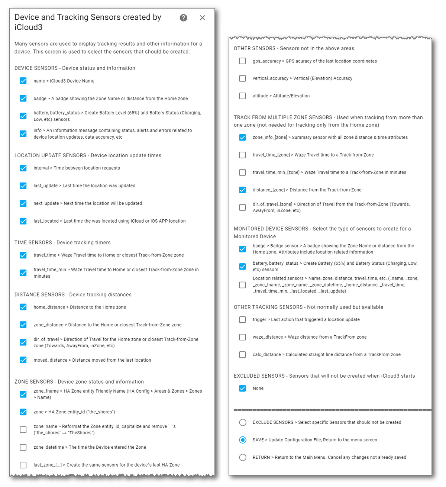
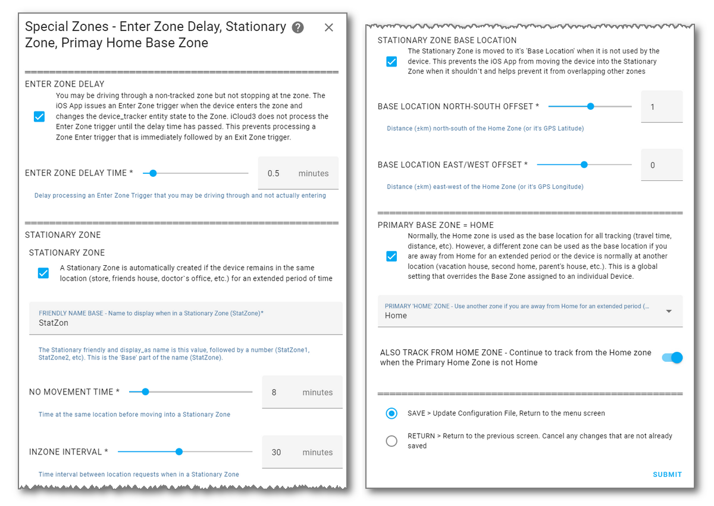
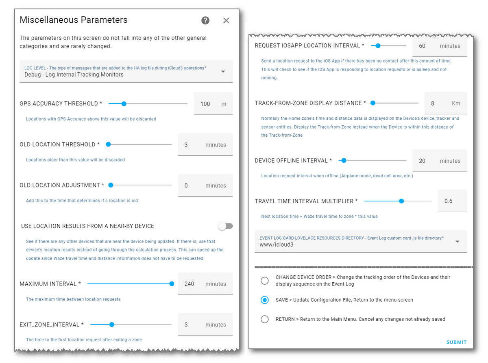

# Configuration Parameters

Configuration parameters for HA components are set up on the *HA Settings > Devices & Settings > Integrations > iCloud3 Configuration* screen previously discussed. 

1. Select **☰ > HA  Settings > Devices & Services > Integrations**
2. Select **iCloud3 > Configure**


​	3, Select **Configure** to open the menu screen on the left below.


The parameters are grouped into categories and updated on various screens introduced in the *Configuring iCloud3 with The Configurator* chapter earlier. 


------

### iCloud Account Login Credentials

This screen is used to enter the iCloud account username & password parameters. It was described in was discussed in the *Installing and Configuring iCloud3 - Step #5* chapter.


Notes:

- Normally, both the iCloud account and the iOS App provides location data. If, however, you are not using the iOS App on any device, and have no plans to do so, set the *Location Data Source* to *iCloud data only*.

- The *password* is stored in the configuration file in an encrypted format. 

- The *username* and *password* fields are obscured on this screen. Select *Show/Hide username/password* to and select *Submit* to display them.

  

------

### Update iCloud3 Devices

This screen is used to:

-  Add a new device (iPhone, iPad, etc) to be tracked
- Select a device to be updated
- Delete a device from the iCloud3 configuration, it's device_tracker entity and all sensor entities associated with the device.

> To stop a device from being tracked without deleting it, set it to an *Inactive* status on the *Update* screen. It's parameters are kept and it's device_tracker and sensor entities are not created.


------

### Update Tracked iCloud3 Device

This screen is used to:

- Update the device's parameters.
- Select the iCloud account Family Sharing and Find-my-Friends device providing location information.
- Select the iOS App device_tracker entity that will be monitored. 
- Select the picture image that is displayed on the *device_tracker* entity and *sensor.[devicename]_badge entity*._
- Select the zones to be tracked from.


------

### Sensors

This screen is used to:

- Select the sensors that will be created for a device.
- Select the additional sensors that will be created for devices that are being tracked from other zones.
- Select the sensors that are created for a monitored device.


------

### Display Text-as

There may be text fields (account numbers, email addresses, etc) that should be considered private and not displayed on the Event Log or in the report that can be exported. This screen is used to:

- Specify the text that should be hidden and the text to display instead.

  


------

### Action Commands

Action commands can be selected on the *Event Log > Actions* deop down list that control iCloud3's operations. Some of those commands can be also selected on this screen. This includes:

- Restart iCloud3
- Pause and Resume tracking 
- Reset and Reauthenticate the iCloud interface to generate a new 6-digit authentication code
- Export the Event Log
- Waze History Database Maintenance


------

### Event Log Configuration

The *Event Log* shows the activity associated with tracking a device. This is used to:

- Configure various display fields (time, distance).
- Specify how zone names should be displayed.
- Specify the directory containing the *icloud3-event-log-card.js* file. 


------

### Waze Route Distance & Time, Waze History Database

Waze is used to provide the driving distance and travel time between the current location and the Home and other tracked from zones. The next location update time is determined with this information. 

The distance and time returned from Waze is stored in the *Waze History Database* using the gps position with 4-decimal places of accuracy (11m/33ft). Over time, the database will contain the distance and time for many '11m blocks' along the routes normally driven.  Accessing the local database is much more efficient than an internet request to Waze, resulting in faster updates and fewer delays when the Waze Route servers are busy.

This screen is used to:

- Specify the Waze server to use in your location and how the distance and time should be determined.
- Specify if the Waze History Database should be used and parameters defining it's operation.


------

### inZone Intervals

The *inZone Interval* is the time between location requests when a device is in a zone. When a device is added, an *inZone Interval* is assigned based on it's type (iPhone, iPad, Watch, etc.). 

- A longer interval (i.e., 2-hours) helps preserve battery life.
- A shorter interval (15-minutes) causes the battery to drain faster as it responds to a 'where are you' location request from iCloud Location servers.

This screen is used to set up the default values assigned to a device when it is added.


------

### Special Zones

#### Pass Through Zone

There are times when you may be driving through one zone on your way to another location. The iOS App recognizes this and issues a *Zone Enter* trigger. This causes:

- iCloud3 to locate the device in the zone.
- The inZone interval is set to it's normal value (2-hours).
- HA may issue triggers based on the zone being entered.

Then you leave the zone 5 or 10-seconds later. 

- The iOS App issues a Zone Exit trigger (hopefully)).
- iCloud3 takes you out of the zone and restarts normal interval tracking.

The *Pass Through Zone* delay prevents this by delaying processing of the *Enter Zone trigger*. If you are still in the zone after this delay, the trigger is processed normally. This only happens on non-tracked from zones. a tracked-from-zone (Home) is processed immediately.

#### Stationary Zone

A Stationary Zone is a zone that is created when the device has been in the same location for a period of time (at a mall, doctor's office, restaurant, friend's house, etc). The purpose of this zone is to reduce location requests when the device has not moved. 


This screen is used to configure these special zones.




------

### Other Parameters

This screen is used to configure other parameters that do not belong on the previous screens.




------


```

```